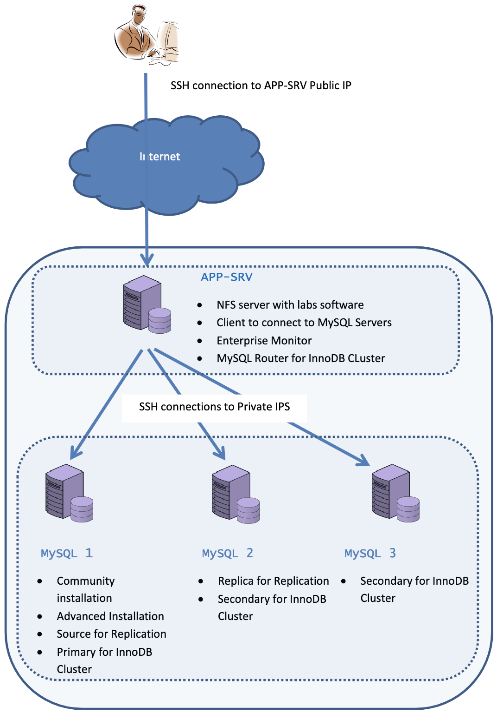

# Introduction

## About this Workshop

MySQL is the world's most popular open source database, it powers many of the most accessed applications.

MySQL Community Edition is available under the GPL license and is supported by a huge and active community of open source developers.

The MySQL Enterprise Edition is a commercial offering comprised of the MySQL database with security, encryption, auditing, high availability and scalability extensions, online backup, monitoring, management, and visual database design and SQL development tools. It reduces the risk, cost, and complexity in developing, deploying, and managing business-critical MySQL applications.

In this workshop, you will learn how to work install MySQL, design your database, manage roles, create a logical backup and you will get to know Enterprise Edition features: MySQL Enterprise Firewall, MySQL Enterprise Audit, MySQL Enterprise Backup and MySQL Enterprise and Monitor.

Overall in this workshop will get you started on using MySQL and MySQL Enterprise Edition features and on how this tools integrate with each other to provide a robust, secure and reliable database.

*Estimated Workshop Time*: 12 hours+

### Lab Setup

### Objectives

In this workshop, you will learn how to work with:
* MySQL Community
* MySQL Enterprise Edition
* MySQL Shell
* Query
* Security - MySQL Users, Roles, Firewall, Audit and Masking
* Database Design - MySQL Tables, JSON, Document Store
* MySQL Enterprise Monitor - Manager, Agent
* MySQL Backup - Logical and Enterprise Backup
* High Availability - Replication and INNODB Cluster
* MySQL Database Service plus HeatWave Step

### Prerequisites 

This lab assumes you have:
* A valid Oracle account on edelivery.oracle.com
* An empty trial environment or a dedicated compartment inside Oracle Cloud Infrastructure (OCI)
* SSH and SCP client to interact with the lab machines
* Basic SQL skills
* Basic linux shell skills

### Workshop standard
When in the tasks you read: 
* shell> the command must be executed in the Operating System shell
* mysql> the command must be executed in a client like mysql, MySQL Workbench.
* mysqlsh> the command must be executed in MySQL shell

## Acknowledgements
* **Author** - Perside Foster, MySQL Solution Engineering, Selena Sánchez, MySQL Solutions Engineer
* **Contributors** -  Perside Foster, MySQL Solution Engineering, Selena Sánchez, MySQL Solutions Engineer
* **Last Updated By/Date** - Selena Sánchez, MySQL Solution Engineering, May 202